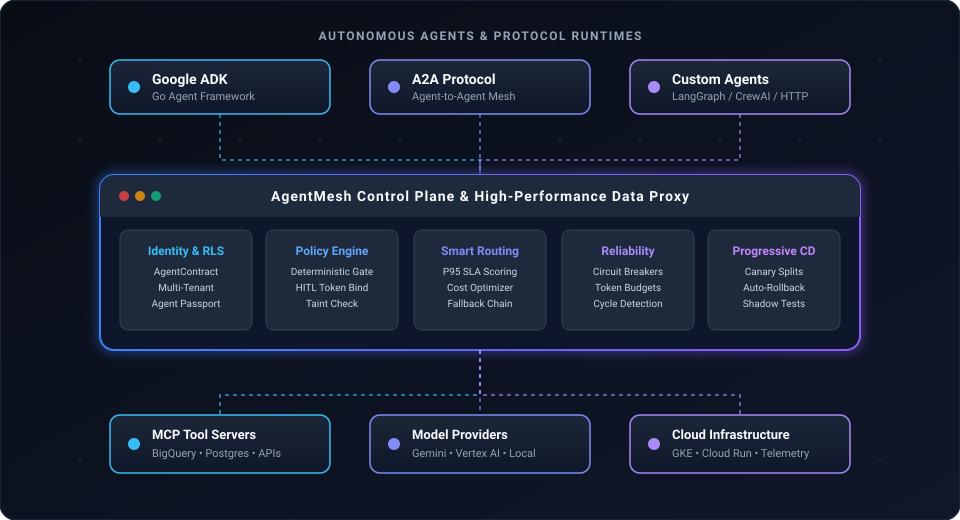
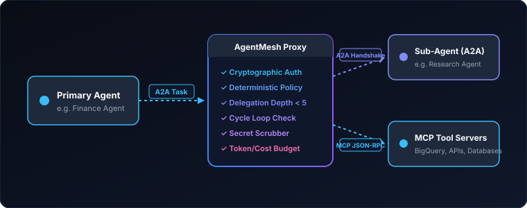
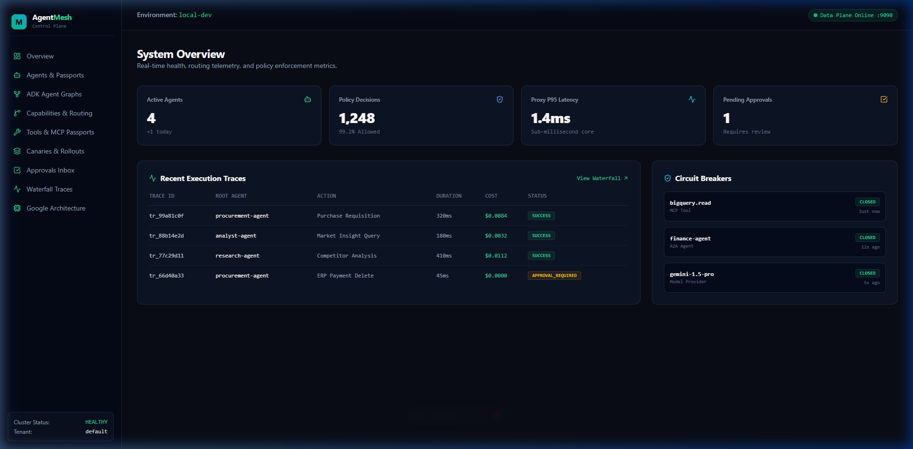
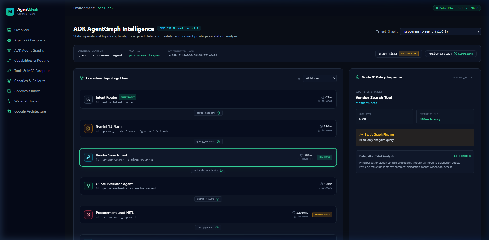
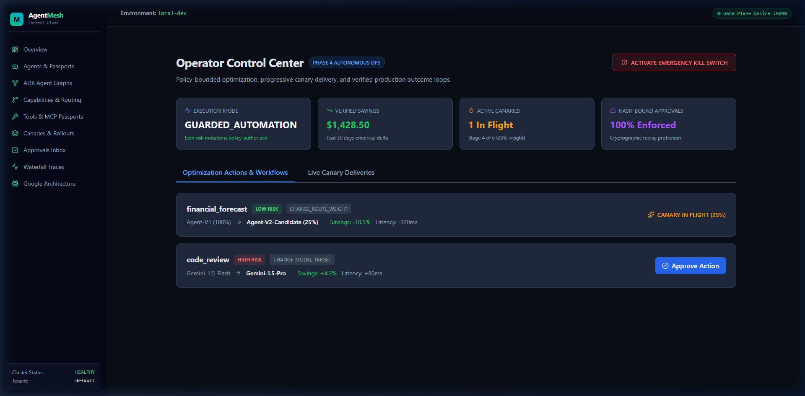
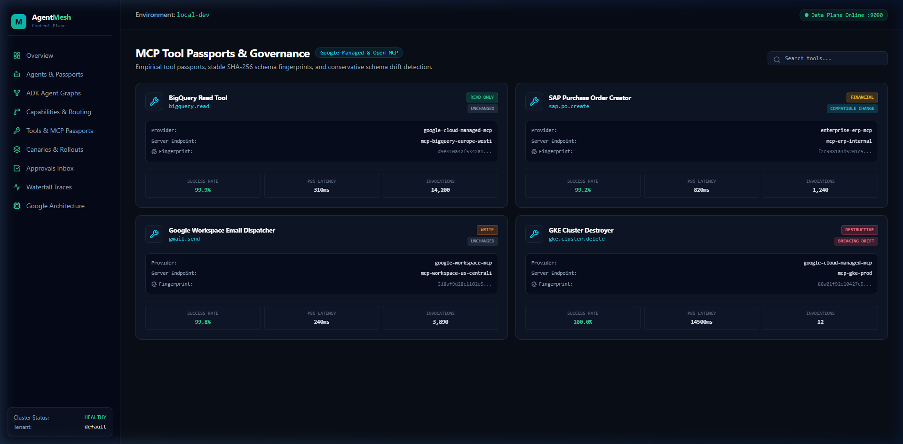

# AgentMesh

**The open control plane for A2A and MCP agents.**

Identity • Policy • Routing • Reliability • Progressive Delivery

[](tests)
[](go.mod)
[](dist/release-manifest.json)
[](LICENSE)
[](docs/LAUNCH_CERTIFICATION.md)

[**Documentation**](docs/API.md) • [**Quickstart**](#-60-second-quickstart) • [**Architecture**](#-architecture--failure-resilience) • [**Google Integrations**](#-built-deeply-for-googles-agent-stack) • [**Security Model**](#-security-model--trust-surface)

> **Run production agents across A2A, MCP, Google ADK, and other runtimes without sacrificing control over identity, permissions, routing, or reliability.**

---



---

## 💡 Why AgentMesh?

As teams deploy autonomous agents into production, agents begin delegating to other agents, invoking Model Context Protocol (MCP) tools, querying multimodal models, and touching internal databases.

Existing agent frameworks help developers **build** agents. But platform and security teams still need **infrastructure** around them.

```text
WITHOUT AGENTMESH                                  WITH AGENTMESH
─────────────────                                  ──────────────
Agent A                                            Agent A
  │ (ad-hoc HTTP / untracked)                        │ [A2A Cryptographic Handshake]
  ▼                                                  ▼
Agent B                                       ┌─────────────────────────────┐
  │ (prompt injection / unverified tools)     │ AGENTMESH CONTROL PLANE     │
  ▼                                           │ • Deterministic Policy Gate │
MCP Tools / APIs                              │ • SLA-Based Capability Route│
  │ (runaway costs / unhandled outages)       │ • HITL One-Time Token Bind  │
  ▼                                           │ • Secret-Scrubbed Telemetry │
Model Provider                                └──────────────┬──────────────┘
                                                             │
Who is allowed to call what?                                 ├──> Sub-Agent (A2A)
What happens when Agent B fails?                             ├──> MCP Tool Server
Which agent should receive the task?                         └──> Gemini / Vertex AI
How do you safely canary an agent update?
```

AgentMesh provides the **deterministic infrastructure layer** between AI agents and the systems they can reach.

---

## ⚡ 60-Second Quickstart

Try AgentMesh locally in less than one minute. **No cloud credentials or external databases required.**

```bash
# 1. Clone repository
git clone https://github.com/agentmesh/agentmesh.git
cd agentmesh

# 2. Build the single static binary
go build -o bin/agentmesh ./cmd/agentmesh

# 3. Verify environment health
./bin/agentmesh doctor

# 4. Run the deterministic multi-agent demonstration
./bin/agentmesh demo run
```

### Real CLI Demo Output

```text
================================================================================
 AgentMesh v1.0 — Deterministic Local Demonstration Network
================================================================================

[1/5] Registering agent contracts with local control plane...
  ✓ research-agent v1.0.0 registered    (capabilities: market-analysis, data-extraction)
  ✓ finance-agent v1.0.0 registered     (capabilities: financial-research, reconciliation)
  ✓ procurement-agent v1.0.0 registered (capabilities: vendor-eval, po-approval)

[2/5] Simulating capability-aware routing engine...
  → Inbound Task: capability 'financial-research'
  ✓ Candidate [finance-agent]:     ELIGIBLE   | Rel: 99.8% | P95: 142ms | Cost: $0.02 [SIMULATED]
  ✓ Candidate [research-agent]:    ELIGIBLE   | Rel: 99.1% | P95: 210ms | Cost: $0.05 [SIMULATED]
  ✗ Candidate [procurement-agent]: INELIGIBLE | Missing requested capability
  → Selected Primary Route: 'finance-agent' (lowest cost satisfying SLA & latency bounds)

[3/5] Evaluating deterministic policy engine...
  → Inspecting tool action: finance-agent -> 'bigquery.read'
  ✓ Decision: ALLOW (Rule: POL-01, DataClass: INTERNAL, Risk: READ)
  → Inspecting tool action: finance-agent -> 'payments.execute'
  🛑 Decision: REQUIRE_APPROVAL (Rule: POL-02, Risk: DESTRUCTIVE, HITL Token required)

[4/5] Executing A2A delegation stack & MCP tool dispatch...
  finance-agent (primary caller)
    ├── [A2A Handshake] ──> research-agent (depth: 1/5, cycle check: PASS)
    │     └── [MCP Tool]  ──> analytics.query (ALLOW, latency: 45ms [SIMULATED])
    └── [MCP Tool]        ──> bigquery.read   (ALLOW, latency: 82ms [SIMULATED])

[5/5] OpenTelemetry execution trace & cost accounting...
  Trace ID:       01J6X7M9A3K5V8E2B1Q4W0Z7R
  Duration:       127ms [SIMULATED]
  Token Usage:    420 prompt + 185 completion [SIMULATED]
  Financial Cost: $0.00142 MicroUSD [SIMULATED]
  Audit Trail:    Cryptographically recorded with SHA-256 parameter digest
  Security Check: Zero policy bypasses | Zero unredacted secrets in spans

✓ Local demonstration completed successfully.
```

---

## 🏛 Core Capabilities

| Capability | Technical Enforcement | Value |
| --- | --- | --- |
| **Identity & Passports** | Cryptographic API keys (`mesh_...`), SPIFFE mTLS, and Agent Passport V2 | Know exactly which agent, revision, and tenant initiated any downstream action. |
| **Semantic Policy** | Deterministic, typed policy rules (`ALLOW`, `DENY`, `REQUIRE_APPROVAL`) | Model hallucinations and prompt injections cannot bypass deterministic code gates. |
| **A2A + MCP Gateway** | Native support for Agent-to-Agent protocol and Model Context Protocol | Unified governance and audit trails across inter-agent delegation and tool invocation. |
| **Capability Routing** | Multi-stage candidate scoring (health, policy, P95 SLA, token cost) | Route tasks to the most reliable, cost-effective eligible agent in real time. |
| **Delegation Taint & Limits** | Ordered call stack tracking, max depth (5 hops), and cycle detection | Eliminates confused deputy privilege escalation and runaway recursive agent loops. |
| **Progressive Delivery** | Weighted canary splits (1% to 100%), automated rollback, shadow execution | Safely deploy new agent revisions, model checkpoints, and updated system prompts. |
| **Reliability & Budgets** | Circuit breakers, safe idempotent retries, and MicroUSD token budgets | Prevent cascading failures, runaway billing loops, and model provider throttling. |
| **Zero-Leak Telemetry** | Automated secret scrubbing across OpenTelemetry traces and logs | Bearer tokens, OpenAI keys, Anthropic keys, AWS secrets, and passwords are automatically redacted. |

---

## 🌐 Protocol Boundaries: A2A + MCP

AgentMesh governs both inter-agent collaboration (A2A) and tool execution (MCP) behind a single unified proxy layer:



---

## 📋 Declarative AgentContract

Every agent declares its capabilities, permissions, delegation bounds, and budgets in a version-controlled YAML manifest:

```yaml
apiVersion: agentmesh.dev/v1
kind: AgentContract

metadata:
  name: finance-agent
  version: "1.0.0"
  organization: acme-corp

capabilities:
  - financial-research
  - reconciliation

tools:
  allow:
    - bigquery.read
    - analytics.query
  deny:
    - raw_sql.execute

delegation:
  maxDepth: 3
  allow:
    - research-agent

budget:
  maxCostPerTaskMicroUSD: 50000 # $0.05 max per task
```

Validate contracts directly in your CI pipeline:

```bash
agentmesh contract validate agentmesh.yaml
```

---

## 🛡 Deterministic Policy Engine

AgentMesh evaluates policies deterministically in compiled Go—**zero LLM invocations in the authorization path**:

```yaml
# policy.yaml
rules:
  # Safe read queries are permitted
  - id: POL-01
    effect: allow
    agent: finance-agent
    tool: bigquery.read

  # Mutating financial transactions require human-in-the-loop approval
  - id: POL-02
    effect: approval
    agent: finance-agent
    tool: payments.execute
    reason: "Payments require human operator approval"

  # Dangerous shell tools are blocked mesh-wide
  - id: POL-03
    effect: deny
    agent: "*"
    tool: "system.exec"
```

Simulate and verify policy rules instantly:

```bash
agentmesh policy simulate --agent=finance-agent --tool=bigquery.read
# Output: ALLOW (Rule: POL-01)
```

---

## 🎯 Capability-Aware Routing

When an agent requests a capability, AgentMesh filters candidates through policy, verifies active health, checks P95 latency against SLOs, and ranks eligible agents by token cost:

```text
Capability: financial-research

Candidate A (finance-agent)
  ✓ Policy: ALLOWED
  ✓ Health: HEALTHY (99.8% SLA)
  ✓ Latency: P95 142ms
  ✓ Cost: $0.02 / task
  → Score: 98.4

Candidate B (research-agent)
  ✓ Policy: ALLOWED
  ✓ Health: HEALTHY (99.1% SLA)
  ✓ Latency: P95 210ms
  ✓ Cost: $0.05 / task
  → Score: 87.1

Candidate C (legacy-agent)
  ✗ Policy: DENIED (Tool access restricted)

Selected Primary Route: finance-agent
Reason: Highest score satisfying SLA, latency, and cost constraints
```

---

## 🚀 Built Deeply for Google's Agent Stack

AgentMesh is engineered for native interoperability with Google's agent ecosystem while remaining **100% vendor-neutral**:

- **Google ADK for Go**: Inspect agent workflow graph topologies, extract tool declarations, and generate contracts.
- **Gemini & Vertex AI**: First-class model adapters with dynamic token accounting, cost tracking, and fallback chains.
- **Google Cloud Run & GKE**: Production-ready multi-stage containers, Helm charts, and Kubernetes Operator.
- **Google Managed MCP**: Deterministic governance over BigQuery, Google Cloud Storage, and Google Maps MCP tools.
- **Workload Identity**: Frictionless, secure cloud authentication without long-lived static JSON credentials.

> *Vendor Neutrality Note: AgentMesh operates across standard A2A, MCP, OpenAI-compatible APIs, Anthropic Claude, open-weights LLMs, and any Kubernetes cluster or cloud provider.*

---

## 🖥 Web Control Plane

The AgentMesh Web Control Plane provides real-time topology visualization, approval queues, and fleet health monitoring:

| Fleet Overview & Health Metrics | Agent Operational Graph & Topologies |
| :---: | :---: |
|  |  |
| **HITL Approval Actions & Kill Switch** | **MCP Tool Governance & Schema Drift** |
|  |  |

---

## 🏗 Architecture & Failure-Resilience

```text
[ Client / Agent Request ]
           │
           ▼
 ┌────────────────────────────────────────────────────────┐
 │ DATA PLANE PROXY FLEET (Stateless, < 15ms overhead)   │
 │ • Edge Cache: Last Known Good (LKG) Signed Config      │
 │ • Deterministic Policy Evaluation                      │
 │ • A2A Handshake & Delegation Stack Verification        │
 │ • MCP Tool Request & Schema Drift Check                │
 └──────────────────────────┬─────────────────────────────┘
                            │ (Async Telemetry & Config Sync)
                            ▼
 ┌────────────────────────────────────────────────────────┐
 │ CONTROL PLANE SERVER (Active-Active Cluster)           │
 │ • Registry & AgentContract Store                       │
 │ • Ed25519 Cryptographic Bundle Publisher               │
 │ • Canary Deployment & Rollback Controller              │
 │ • Multi-Tenant Row-Level Security (PostgreSQL 16+)     │
 └────────────────────────────────────────────────────────┘
```

### Built for Failure

1. **Control Plane Outage**: If the control plane or database becomes unreachable, **the data plane continues routing and enforcing policy** using its local in-memory cache and verified Last Known Good (LKG) signed bundle.
2. **Model Outage / Rate-Limiting**: The router automatically diverts traffic to fallback agents or secondary model providers upon detecting repeated provider errors.
3. **Canary Regression**: If a new agent revision causes error rates or latency to spike, the canary controller **aborts and rolls back to baseline traffic within 60 seconds**.
4. **Runaway Loop Protection**: The emergency kill switch (`agentmesh control freeze`) halts all autonomous mutating actions mesh-wide instantaneously.

---

## 🔒 Security Model & Trust Surface

AgentMesh is engineered under strict zero-trust principles:

- **Default-Deny**: Unregistered agents, unauthorized tools, and undeclared delegation paths are blocked by default.
- **Tenant Isolation**: Complete physical and logical data isolation enforced via PostgreSQL Row-Level Security (`ErrEmptyTenant`).
- **Cryptographic Parameter Binding**: Human-in-the-loop (HITL) approval tokens bind to `sha256(canonical_json(params))` to prevent post-approval parameter tampering.
- **SSRF Prevention**: All outbound A2A and webhook registrations validate target IP addresses, blocking private RFC1918 ranges, loopback, and cloud metadata endpoints (`169.254.169.254`).
- **Zero-Prompt Storage**: AgentMesh never persists raw agent prompts or LLM output bodies. Payloads exist only in transient memory during evaluation.

For complete architectural and operational security documentation:

- [STRIDE Threat Model](docs/THREAT_MODEL.md)
- [RBAC Authorization Matrix](docs/AUTHORIZATION_MATRIX.md)
- [Enterprise Pricing Strategy & TCO](docs/PRICING_STRATEGY.md)
- [Competitive Analysis & Moat Playbook](docs/COMPETITIVE_ANALYSIS.md)
- [Top 100 System Recommendations](docs/TOP_100_RECOMMENDATIONS.md)
- [Security Policy & Vulnerability Reporting](SECURITY.md)
- [Privacy & Data Governance](PRIVACY.md)
- [Launch Certification Certificate](docs/LAUNCH_CERTIFICATION.md)

---

## ⚖ Comparison

| Feature | AgentMesh | Generic API Gateway (Kong/Envoy) | Agent Frameworks (LangGraph/CrewAI) |
| --- | :---: | :---: | :---: |
| **Agent Identity & Passports** | ✅ Cryptographic | ❌ Endpoint only | ⚠️ In-memory / variable |
| **A2A Protocol Governance** | ✅ Native Handshakes | ❌ Protocol-blind | ⚠️ Custom per framework |
| **MCP Tool Risk Gate** | ✅ Schema diff & HITL | ❌ HTTP/REST only | ⚠️ Unchecked model calls |
| **Delegation Taint Checking** | ✅ Confused Deputy Defense | ❌ No delegation awareness | ❌ No cross-agent bounds |
| **Capability Routing** | ✅ Health, SLA & Cost | ❌ Path/Host routing only | ⚠️ Hardcoded routing |
| **Progressive Agent Canaries** | ✅ Automated Rollbacks | ⚠️ Traffic split only | ❌ Manual rollback |
| **Zero-Prompt Storage** | ✅ Guaranteed | ⚠️ Configurable | ⚠️ Often persisted |

> For an in-depth 25-criteria matrix across 5 industry quadrants, TCO modeling, and objection handling battlecards, see the [Enterprise Competitive Analysis](docs/COMPETITIVE_ANALYSIS.md).

---

## 📦 Feature Maturity Matrix

| Component | Status | Production Guidance |
| --- | :---: | --- |
| **A2A Data-Plane Proxy** | `Stable` | Certified for general production multi-agent routing. |
| **MCP Policy Gateway** | `Stable` | Certified for stdio and SSE MCP server governance. |
| **Deterministic Policy Engine** | `Stable` | Evaluates compiled rules with 0ms LLM overhead. |
| **AgentContract & AgentBOM** | `Stable` | Schema v1 frozen with backward-compatibility guarantees. |
| **Capability-Aware Routing** | `Stable` | Multi-stage SLA and token cost candidate ranking. |
| **Progressive Delivery & Canaries** | `Stable` | Weighted traffic splits and automated regression rollback. |
| **Learned Routing Optimization** | `Beta` | Operates in shadow mode; requires evidence threshold before promotion. |

---

## ❓ Frequently Asked Questions

### Why is AgentMesh written in Go?

The AgentMesh data plane requires low latency (< 15ms overhead), predictable garbage collection, streaming concurrency, and single static binaries that deploy cleanly onto Kubernetes and bare metal. Go provides the ideal balance of performance, safety, and cloud-native ecosystem tooling.

### Why not just use an API Gateway like Envoy or Kong?

Standard API gateways operate on raw HTTP paths, IP addresses, and DNS endpoints. They have zero conceptual awareness of **agent identities**, **delegation chains**, **model context protocol (MCP) tool schemas**, **prompt taint propagation**, or **agent SLO regressions**. AgentMesh is built specifically to model and govern agentic relationships.

### How does AgentMesh complement Google ADK?

Google ADK enables developers to build sophisticated Go agents. AgentMesh operates as the control plane and proxy that governs how those ADK agents talk to other agents, execute tools, consume token budgets, and deploy through canary stages.

---

## 🗺 Roadmap

### v1.x (Current Release)

- [x] Production-certified Go control plane and data-plane proxy
- [x] A2A and MCP protocol governance
- [x] Deterministic semantic policy with HITL token binding
- [x] Capability-aware routing with token budget optimization
- [x] Google ADK, Gemini, Vertex AI, and GKE integration
- [x] Web Control Plane dashboard and Next.js 15 UI

### v2.0 (Planned)

- [ ] Automated continuous prompt regression evaluation in CI/CD
- [ ] Post-Quantum hybrid cryptographic bundle signing (ML-DSA)
- [ ] Google Cloud Spanner distributed multi-region database adapter
- [ ] Dynamic WebAssembly (Wasm) policy execution modules

---

## 🤝 Community & Contributing

We welcome contributions from agent builders, infrastructure engineers, and security researchers!

- Check out our [Contributing Guide](CONTRIBUTING.md) to get started.
- Review our [Code of Conduct](CODE_OF_CONDUCT.md).
- To report security vulnerabilities responsibly, please review [SECURITY.md](SECURITY.md).

---

## 📄 License

AgentMesh open-source core is licensed under the [Apache-2.0 License](LICENSE).
